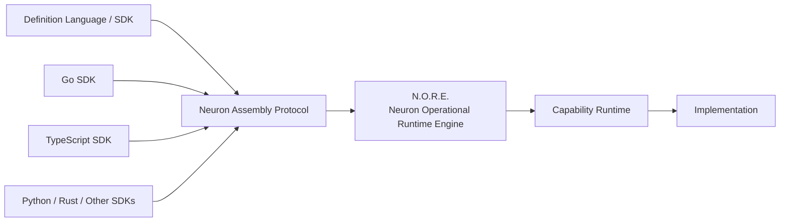
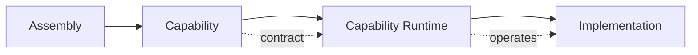

# Neuron

### A language-agnostic runtime for composing and operating software capabilities.

Neuron is an open runtime architecture for building software systems from **Capabilities** that can be defined and operated across different languages and execution environments.

At the center of Neuron is the **Neuron Assembly Protocol**: a language-neutral representation of capabilities, their contracts, configuration, and composition.



The definition language does not become part of the runtime model. A TypeScript SDK, Go SDK, Python SDK, Rust SDK, or another future frontend can describe capabilities through the same protocol.

The same principle applies to execution. A Capability can be operated through different Capability Runtimes, including process, WebAssembly, remote, or other supported environments. The implementation language remains an implementation detail; the protocol is the boundary.

---

## Why Neuron

Software systems increasingly bring together APIs, data stores, AI models, local processes, remote services, and specialized execution environments.

Neuron provides a common architectural boundary for composing these capabilities without requiring them to share the same language or implementation environment.

A **Capability** represents executable functionality.

An **Assembly** describes how capabilities form a larger software system.

The **Neuron Assembly Protocol** connects definition tooling with the runtime.

**N.O.R.E. — Neuron Operational Runtime Engine** operates those definitions through the available Capability Runtimes.

This separation allows implementations to evolve independently from system definitions while giving different languages and execution environments a common way to participate.

> **Neuron is language-agnostic by design — from Assembly definition to Capability implementation.**
> 

---

## The Neuron Model

A Capability defines what a component provides. An Assembly composes those capabilities into a larger system. A Capability Runtime provides the environment required to operate an implementation.



The runtime does not need to know whether a Capability was defined through TypeScript, Go, or another language. It operates the language-neutral representation produced through the Neuron Assembly Protocol.

---

## Language-Agnostic by Design

Neuron's SDK model is intentionally not tied to TypeScript.

For example, a Capability can be declared through the TypeScript SDK:

```tsx
const inference = Capability({
  name: "model.inference",
  version: "1.0.0",
})
.runtime({
  name: "neuron:core:process",
});
```

The same semantic Capability can be defined from another language through its corresponding SDK:

```go
inference := neuron.Capability(neuron.CapabilityConfig{
    Name:    "model.inference",
    Version: "1.0.0",
}).Runtime(neuron.RuntimeConfig{
    Name: "neuron:core:process",
})
```

These are different language frontends to the same architectural model. The runtime does not need a TypeScript or Go-specific execution path.

---

## Neuron Assembly Protocol

The **Neuron Assembly Protocol** is the stable boundary between definition tooling and N.O.R.E.

SDKs act as language-specific frontends. They produce the protocol representation; N.O.R.E. operates that representation through the existing Capability Runtime architecture.

This makes the protocol useful beyond the SDKs maintained by Neuron itself. A new language, toolchain, or definition frontend can participate by implementing the protocol rather than coupling directly to N.O.R.E.'s internal representation.

---

## Built for Real Systems

Neuron is designed for systems where capabilities may come from very different environments.

An Assembly could bring together an AI inference component, a specialized data processor, a remote API capability, a local filesystem operation, and a WebAssembly implementation while keeping each capability in its appropriate execution environment.

Neuron provides the common contracts needed to compose those capabilities without forcing them into a single language, runtime, or implementation model.

---

## Ecosystem

This organization will host the Neuron runtime, SDKs, protocol implementations, tooling, and supporting projects as the ecosystem develops.

More repositories and documentation will be added here over time.

> **Neuron**
> 
> 
> Language-agnostic runtime infrastructure for composing and operating software capabilities.
>
